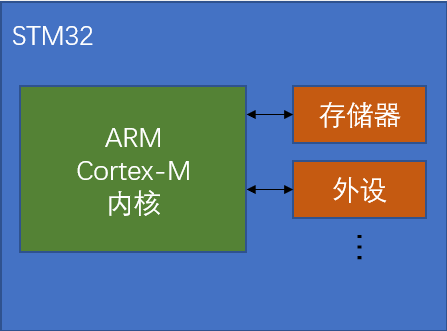
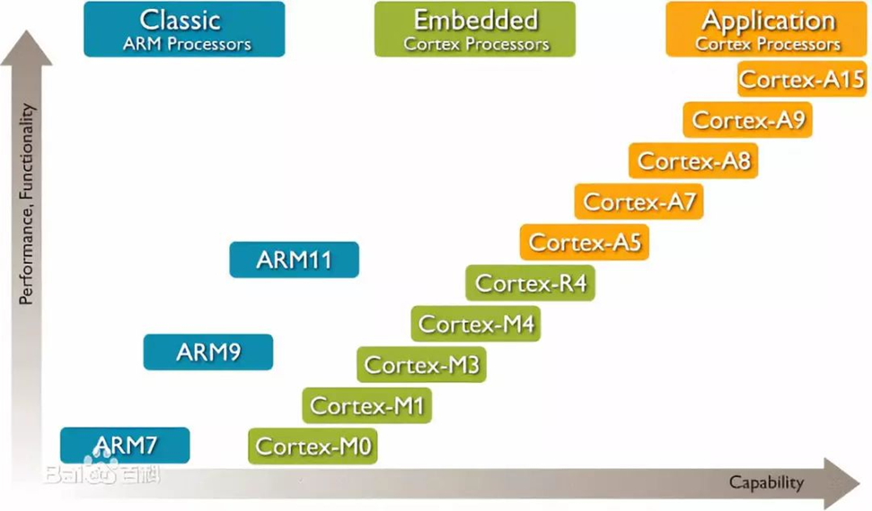
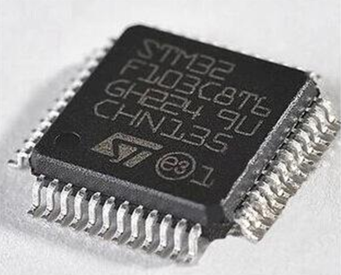
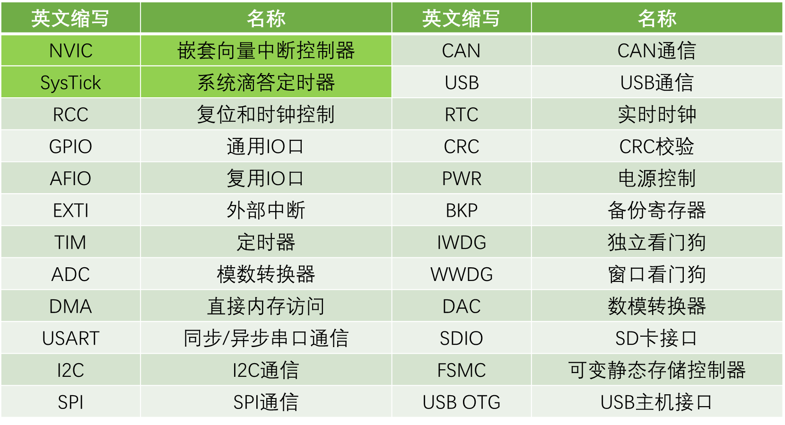
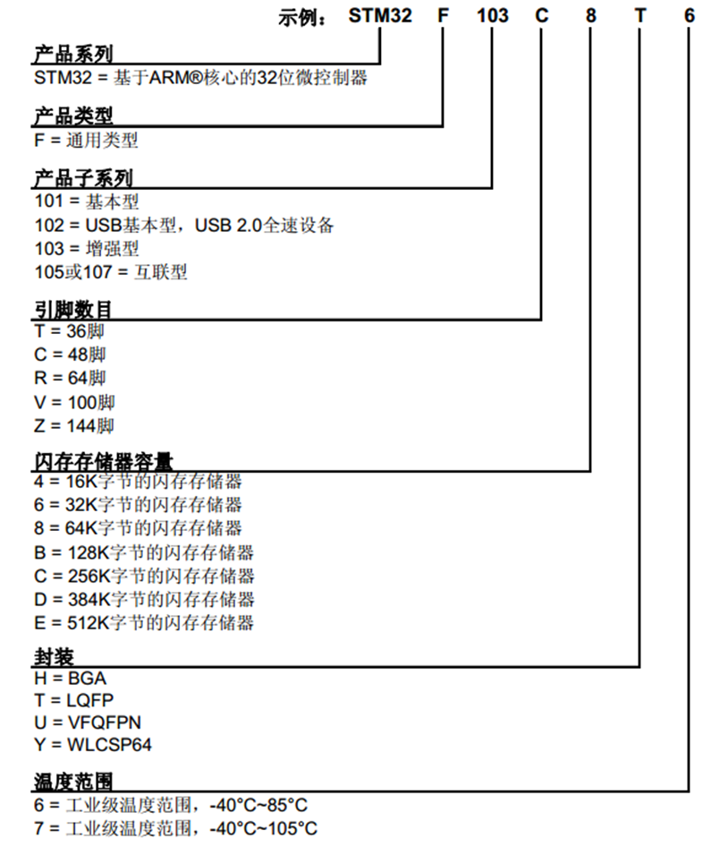

## STm32基础知识
### STm32简介：

• STM32是ST公司基于ARM Cortex-M内核开发的32位微控制器  
• STM32常应用在嵌入式领域，如智能车、无人机、机器人、无线通信、物联网、工业控制、娱乐电子产品等  
• STM32功能强大、性能优异、片上资源丰富、功耗低，是一款经典的嵌入式微控制器  

图1：STm32产品线

图中的CoreMark是内核跑分的意思  

### ARM公司

• ARM既指ARM公司，也指ARM处理器内核。  
• ARM公司是全球领先的半导体知识产权（IP）提供商，全世界超过95%的智能手机和平板电脑都采用ARM架构。  
• ARM公司设计ARM内核，半导体厂商完善内核周边电路并生产芯片。对于STm32来说，ST公司设计的就是内核之外的存储器和外设，比如说计数器、定时器等，以PC机来举例说明，ARM就相当于英特尔或者AMD，ST公司就是负责拿着这个设计好的CPU来添加上主板、内存等设备来构成一个整机卖给客户。严格来说PC整机应该对应的是片上SoC，STm32对应的应该算是PLC，这两者的区别简单来说主要是能不能运行类Linux的操作系统，从硬件上虽然可以说二者的硬件规格不同，SoC拥有更多的功能模块，但是存在。

图2：STm32简易结构图

图3：ARM核心产品线

### STm32F103C8T6

•系列：STm32F1系列  
•内核：ARM Cortex-M3  
•主频：72MHz  
•RAM：20K（SRAM）RAM为存储内存，实际存储介质为SRAM  
•ROM：64K（Flash）ROM程序存储器，实际介质为Flash  
•供电：2.0~3.6V（标准3.3V）。这里需要注意的是，C51和USB都是5V供电，所以在使用STm32的时候要加一个稳压芯片，将5V电压降至3.3V才能给STm32供电。  
•封装：LQFP48 意思是一共有48个引脚 

**拓展知识**：1.8V、3.3V、5V、12V等常用电压等级是如何确立的？

早期晶体管电路单管压降0.7V，一个电路里经常多个晶体管串联。比如4管串联，电源至少保证0.7x4=2.8V才能保证电路正常工作。所以早期有3V，5V等标准。后来7805电源IC出来以后，5V成了事实标准。3.3V是因为当年演进到.35μm工艺的时候栅极氧化层厚度减到了7nm左右，能承受的最大源漏电压大概是4V，减去10%安全裕度是3.6V，又因为板级电路的供电网络一般是保证±10%的裕量，所以标准定在了3.6V × 90% = 3.3V。1.8V同理，18um节点栅极氧化层厚度进一步降低到了4nm左右，ds耐压极限降低到了大约2.3V，同样的逻辑，先0.9变成2.7，再±10%，定在了1.8V。

图4：STm32F103C8T6实物图

### 片上资源/外设

图5：STm32外设汇总表

外设的英文名字为Peripheral ，学习STm32主要学习的就是通过程序配置STm32的外设，来实现我们想要的功能。在汇总表中加绿色的是位于Cortex-M3内核中的外设，之所以要区分是内核中的外设还是内核之外的外设，是为了在不同的库函数中查找相应外设的函数。

​	**NVIC**：用于管理中断的设备，配置中断的优先级。  
​	**SysTick**：STm32是可以加入操作系统的，比如FreeRTOS，UCos等，如果用了这些操作系统，就需要SysTick提供定时来进行任务切换的功能，也可以用于Delay()延时函数的实现。  
​	**RCC**：对时钟进行控制，使能各模块时钟，在STm32中其它外设在上电情况下默认没有时钟的，不给时钟的情况下，操作时钟是无效的，外设也不会工作，这样的目的是降低功耗，所以在操作外设前要先使能时钟，用RCC完成时钟使能。  
​	**GPIO**：  
​	**AFIO**：完成复用功能端口的重定义和中断端口的配置。  
​	**EXIT**：配置好外部中断后，当引脚电平发生变化时，就可以触发中断，让CPU来处理任务。  
​	**TIM**：定时器分为高级定时器、通用定时器、基本定时器。常用的是通用定时器，这个定时器除了基本的定时工作外，还可以定时中断、测频率、输出PWM波、配置专用编码器接口。  
​	**ADC**：STm32中内置了12位的AD转换。  
​	**DMA**：充当CPU的助手，帮助CPU搬运文件。  
​	**USART**：同步或异步串口，UART是异步串口。  
​	**IIC**：  
​	**SPI**：这两个都是通讯协议。  
​	**CAN**：主要用于汽车领域。  
​	**USB**：学习这个协议之后可以用于模拟鼠标，模拟U盘。  
​	**RTC**：完成年月日时分秒计时功能，可以接外部备用电池，这样即使掉电的情况下也可以正常运行。  
​	**CRC**：数据的一种校验方式，用于判断数据的正确性。  
​	**PWR**：可以让芯片进入睡眠状态。  
​	**BKP**：可由备用电池保持数据。  
​	**IWDG**：独立看门狗，可以使用后备电源供电，在程序运行出错的时候进行复位。  
​	**WWDG**： 这两个在STm32出现死循环的时候可以及时复位芯片。因为电磁干扰。死机或程序设计不合理导致死循环时，看门狗可以及时复位芯片。  

**STm32F103C8T6没有下面的四个外设**
	**DAC**：数模转换器，用于将数字信号转化为模拟信号。
	**SDIO**：读取SD卡。
	**FSMC**：扩展内存或配置成其它总线协议，用于某些硬件的操作。
	**USB OTG**：用OTG功能，让USB作为主机去读取其它的USB设备。

### 命名规则

图6：STm32命名规则

### 系统结构

​	从STm32F103系统结构示意图可以看出，内核Cortex-M3引出了三条总线，分别是ICode指令总线、DCode数据总线、System系统总线。其中ICode总线和DCode总线主要是用来通过Flash接口连接Flash闪存的，Flash是一种掉电不丢失的非易失性存储介质，STm32的程序就是存储在内部Flash中，而程序运行时产生的变量数据存放在SRAM中。ICode总线是用来加载程序指令的，DCode总线用来加载数据，比如常量和调试数据等。除了DCode总线和ICode总线，内核还引出了System总线，用来连接余下的设备。

​	Cortex-M3下方就是DMA外设，DMA可以当做内核的小秘书，其作用是搬运数据来减轻重复性数据搬运工作对CPU资源的占用。比如说模数转换设置为1ms转换一次，如果不能及时将转换后的数字信号数据从数模转换寄存器中搬运出来的话，新转换完成的信号数据就会被覆盖。外设通过DMA请求线向DMA发送DMA请求，DMA通过DMA总线获得总线控制权，然后访问外设并转运数据，整个过程不用CPU参与，省下了CPU的时间来做其它事情。图中的DMA总线拥有和CPU一样的总线控制权用于访问外设。

​	图中的右下角就是AHB总线和AHB总线所挂载的外设，**AHB(Advanced High-performance Bus)**是先进高性能总线，用于挂载主要的设备，一般都是最基本或性能比较高的外设，比如复位和时钟控制这些最基本的电路，AHB总线通过桥接器连接到**APB(Advanced Peripheral Bus )**先进外设总线，APB总线又分为APB1总线和APB2总线。因为AHB总线和APB总线的总线协议、总线速度、数据传送格式的差异，所以二者相连时中间需要加桥接来完成数据的转换和缓存。AHB通过桥接1连接到APB2总线，通过桥接2连接到APB1总线。性能的话AHB>APB，APB2>APB1。APB2一般和AHB同频都是72MHz，APB1为36MHz，APB2连接的都是重要外设，以及一些外设的一号选手，比如说USART1和SPI1，而APB2连接的都是一些次要的外设。